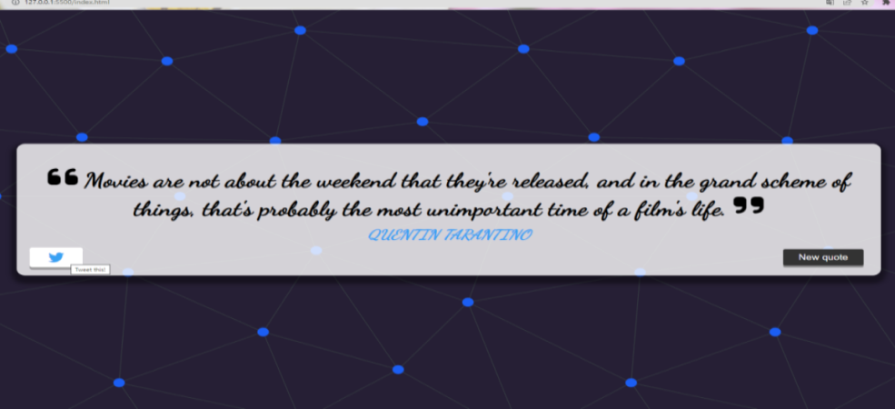

# Quote generator

## Quote generator loading page

To get access to the app's content you need to run it into your browser.

## Content

After loading page, first quote randomly appears from fetched API. 

To get another randomly fetched and displayed quote, user must click on the button \"New quote\".

...clicking on twitter button will direct user to his user account on twitter where he can tweet the quote.

# 👉 Built with
* HTML5
* CSS3
* JS

# 💻 Development
1. run index.html on your browser
2. git clone https://github.com/valerijadrinek/quote-generator.git
3. github pages https://valerijadrinek.github.io/quote-generator/
